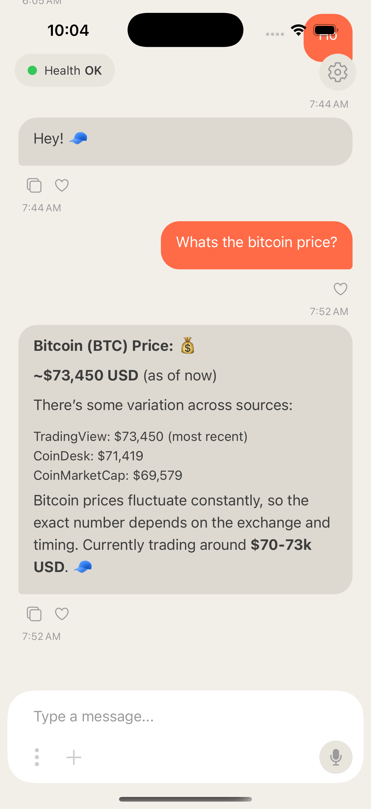
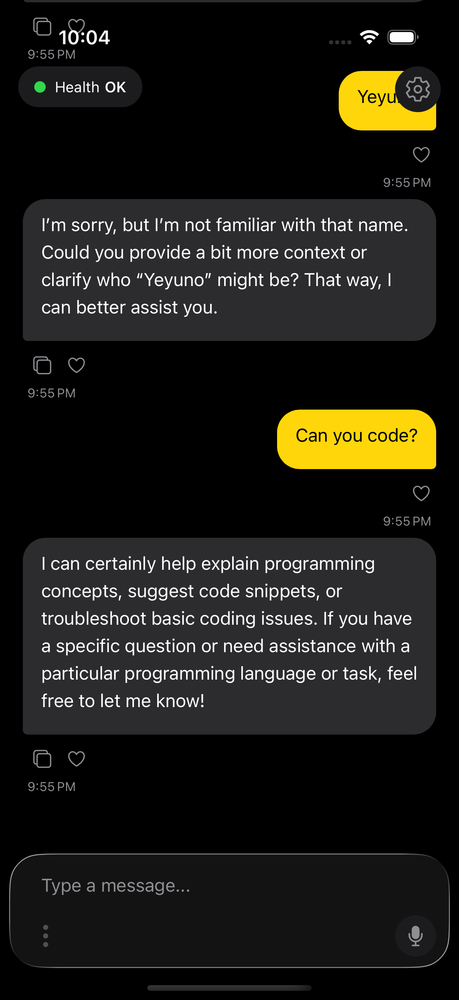
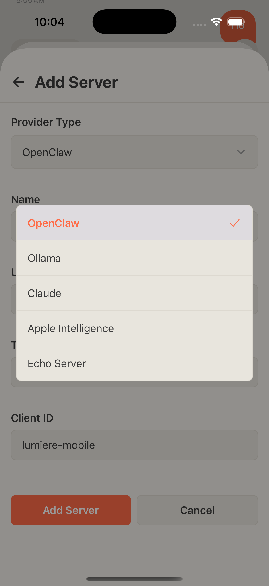
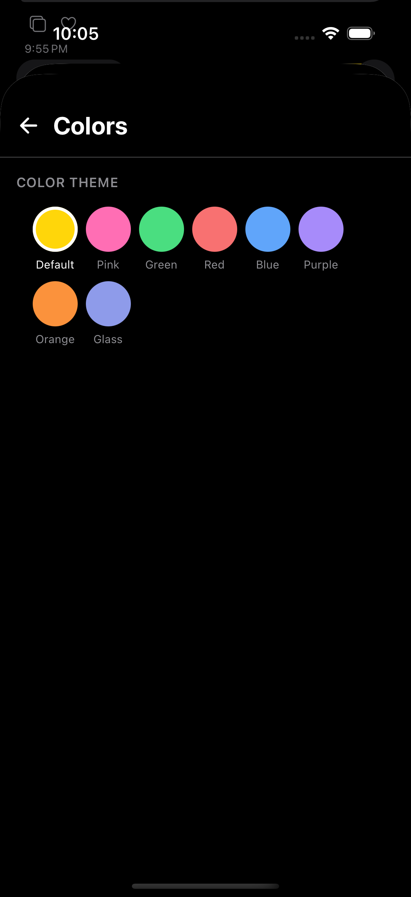
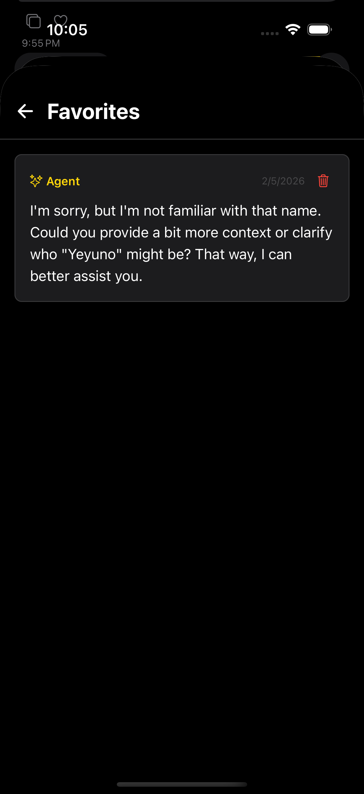

<p align="center">
  
</p>

<h1 align="center">Lumiere</h1>

<p align="center">
  A React Native mobile client for interacting with AI agents. Supports multiple providers including OpenClaw, Claude, Ollama, and Apple Intelligence.
</p>

<p align="center">
  <a href="#features">Features</a> •
  <a href="#ai-providers">AI Providers</a> •
  <a href="#screens">Screens</a> •
  <a href="#screenshots">Screenshots</a> •
  <a href="#getting-started">Getting Started</a> •
  <a href="#architecture">Architecture</a> •
  <a href="#contributing">Contributing</a> •
  <a href="#license">License</a>
</p>

---

## Features

### Core

- **Multi-provider support** — Connect to OpenClaw, Claude, Ollama, Apple Intelligence, or Echo Server
- **Multi-server management** — Configure and switch between multiple AI servers
- **Real-time streaming** — Streamed AI responses with markdown rendering
- **Image attachments** — Attach images to chat messages (provider-dependent)
- **Message queue** — Queue messages while the agent is responding
- **Slash commands** — 38 built-in commands with autocomplete

### Voice & Input

- **Voice transcription** — Dictate messages using native iOS speech recognition
- **Recording overlay** — Visual feedback with real-time transcription preview

### Personalization

- **Color themes** — 8 color palettes (Default, Pink, Green, Red, Blue, Purple, Orange, Glass)
- **Light & dark modes** — System-aware theming with manual override
- **Session aliases** — Custom display names for chat sessions

### Automation

- **Triggers** — Create deep links that auto-send messages to specific sessions
- **Quick actions** — Home screen shortcuts (iOS 3D Touch / Android) linked to triggers
- **Cron scheduler** — Schedule recurring agent tasks (OpenClaw only)
- **Background notifications** — Get notified of new messages when app is backgrounded

### Security

- **Face ID / Touch ID** — Biometric authentication on app launch and resume
- **Secure storage** — API keys and tokens stored securely

### Platform

- **iPad support** — Responsive layouts with form sheet modals on tablet
- **Deep linking** — Open screens and execute triggers via `lumiere://` URLs

## AI Providers

| Provider               | Type      | Chat | Images | Sessions | History | Scheduler |
| ---------------------- | --------- | :--: | :----: | :------: | :-----: | :-------: |
| **OpenClaw**           | `molt`    |  ✅  |   ✅   |    ✅    |   ✅    |    ✅     |
| **Claude**             | `claude` |  ✅  |   ✅   |    —     |    —    |     —     |
| **Ollama**             | `ollama`  |  ✅  |   —    |    —     |    —    |     —     |
| **Apple Intelligence** | `apple`   |  ✅  |   —    |    —     |    —    |     —     |
| **Echo Server**        | `echo`    |  ✅  |   —    |    —     |    —    |     —     |

### OpenClaw (Molt Gateway)

Full-featured provider with WebSocket streaming, server-side sessions, chat history persistence, and cron job scheduling. Requires a running Molt Gateway instance.

### Claude (Anthropic API)

Direct integration with Anthropic's Messages API. Supports streaming responses and image attachments. Requires an Anthropic API key.

### Ollama

Connect to a local Ollama instance for offline AI. Includes a model selection screen to switch between installed models.

### Apple Intelligence

On-device AI using Apple Foundation Models. Requires iOS 18+ with Apple Intelligence support. No external server needed.

### Echo Server

Testing provider that echoes messages back. Useful for development and debugging.

## Screens

| Screen            | File                    | Description                                                                                                           |
| ----------------- | ----------------------- | --------------------------------------------------------------------------------------------------------------------- |
| **Chat**          | `app/index.tsx`         | Main chat interface with streaming responses, markdown rendering, voice input, slash commands, and message favoriting |
| **Settings**      | `app/settings.tsx`      | App configuration including appearance, security, notifications, and account management                               |
| **Servers**       | `app/servers.tsx`       | View, switch, and manage configured AI servers                                                                        |
| **Add Server**    | `app/add-server.tsx`    | Configure a new server with provider-specific fields                                                                  |
| **Edit Server**   | `app/edit-server.tsx`   | Modify or delete existing server configuration                                                                        |
| **Sessions**      | `app/sessions.tsx`      | Create, switch, and reset chat sessions (OpenClaw)                                                                    |
| **Edit Session**  | `app/edit-session.tsx`  | Rename sessions with custom aliases                                                                                   |
| **Overview**      | `app/overview.tsx`      | Gateway monitoring dashboard with health status (OpenClaw)                                                            |
| **Scheduler**     | `app/scheduler.tsx`     | Cron job management (OpenClaw)                                                                                        |
| **Favorites**     | `app/favorites.tsx`     | Saved messages viewer                                                                                                 |
| **Triggers**      | `app/triggers.tsx`      | Create and manage auto-send deep links                                                                                |
| **Colors**        | `app/colors.tsx`        | Color theme selection                                                                                                 |
| **Ollama Models** | `app/ollama-models.tsx` | Model selection for Ollama provider                                                                                   |
| **Gallery**       | `app/gallery.tsx`       | Component showcase for development                                                                                    |

### Navigation Flow

```
RootLayout (ThemeProvider + KeyboardProvider)
├── OnboardingScreen (if first launch)
├── BiometricLockScreen (if Face ID enabled)
└── Stack Navigator
    ├── Chat (index)
    ├── Settings
    ├── Servers / Add Server / Edit Server
    ├── Sessions / Edit Session
    ├── Overview (OpenClaw)
    ├── Scheduler (OpenClaw)
    ├── Favorites
    ├── Triggers
    ├── Colors
    ├── Ollama Models (Ollama)
    └── Gallery
```

## Screenshots

<p align="center">
  
  
  
</p>

<p align="center">
  
  
  
</p>

## Getting Started

### Prerequisites

- Node.js 18+
- [pnpm](https://pnpm.io/) package manager
- [Expo CLI](https://docs.expo.dev/get-started/installation/)
- iOS Simulator (macOS) or Android Emulator

### Installation

```bash
pnpm install
pnpm start
```

### Adding a Server

1. Open the app and tap the settings gear icon
2. Tap the + button next to "Servers"
3. Select a provider type (OpenClaw, Claude, Ollama, Apple Intelligence, or Echo)
4. Fill in the required fields:
   - **OpenClaw**: Name, WebSocket URL, Token, Client ID
   - **Claude**: Name, API Key
   - **Ollama**: Name, Server URL (default: `http://localhost:11434`)
   - **Apple Intelligence**: Name only (on-device)
   - **Echo**: Name only (for testing)
5. Tap "Add Server"

### Deep Linking

Open screens directly using `lumiere://` URLs:

| URL                                    | Action             |
| -------------------------------------- | ------------------ |
| `lumiere://chat`                       | Chat screen        |
| `lumiere://settings`                   | Settings           |
| `lumiere://servers`                    | Server management  |
| `lumiere://sessions`                   | Session management |
| `lumiere://overview`                   | Gateway overview   |
| `lumiere://scheduler`                  | Cron scheduler     |
| `lumiere://favorites`                  | Favorites          |
| `lumiere://triggers`                   | Triggers           |
| `lumiere://colors`                     | Color themes       |
| `lumiere://trigger/autotrigger/{slug}` | Execute a trigger  |

## Architecture

```
app/                    Expo Router file-based routes
├── _layout.tsx         Root layout with providers and auth gates
└── *.tsx               Screen routes

src/
├── components/
│   ├── chat/           Chat UI (ChatScreen, ChatInput, ChatMessage)
│   └── ui/             Reusable components (Button, Card, Badge, etc.)
├── screens/            Onboarding and lock screens
├── services/
│   ├── molt/           OpenClaw WebSocket client
│   ├── claude/         Claude/Anthropic API client
│   ├── ollama/         Ollama HTTP client
│   ├── apple-intelligence/  Apple Foundation Models wrapper
│   └── echo/           Echo test provider
├── modules/
│   ├── speech-transcription/  Native iOS speech recognition
│   └── apple-intelligence/    Native Apple Foundation Models
├── hooks/              Custom hooks (useServers, useVoiceTranscription, etc.)
├── store/              Jotai atoms with AsyncStorage persistence
├── theme/              Theme system (colors, typography, spacing)
└── utils/              Utilities (device detection, etc.)
```

**Key dependencies:** React Native 0.81, Expo 54, Expo Router 6, Jotai (state), React Native Reanimated (animations).

## Platform-Specific Features

### iOS Only

- Voice transcription via native Speech Recognition
- Apple Intelligence provider (iOS 18+)
- 3D Touch quick actions
- Glass effect input styling

### iPad

- Form sheet modals instead of full-screen
- Responsive layouts
- Landscape orientation support

## Contributing

1. Fork the repository
2. Create a feature branch (`git checkout -b feature/my-feature`)
3. Commit your changes (`git commit -m 'Add my feature'`)
4. Push to the branch (`git push origin feature/my-feature`)
5. Open a Pull Request

Please run `pnpm lint` and `pnpm format:check` before submitting.

## License

[MIT](LICENSE)
